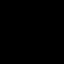
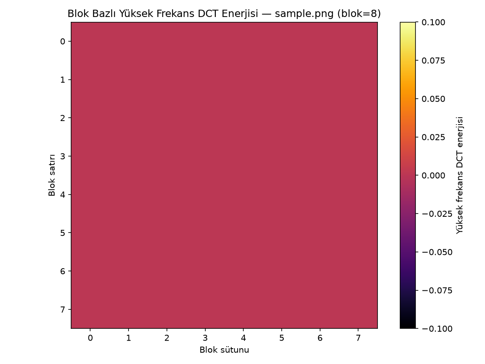
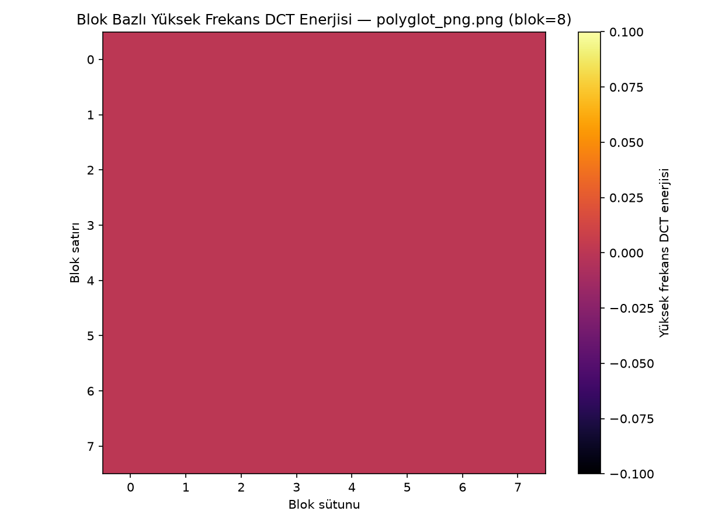

# Gün 7 — LSB ve DCT Frekans Alanı Gürültü Analizi

## Hedef
OpenCV ile görsel üzerinde LSB (en az anlamlı bit) steganografi izlerini ve
DCT (Ayrık Kosinüs Dönüşümü) tabanlı frekans anomalilerini incelemek;
görsel/istatistiksel olarak temiz dosya ile manipüle edilmiş dosya
arasındaki farkı ortaya koymak.

## Tasarım Notu — Neden Ayrı Bir Demo Örnek Gerekti
Bu projenin ana tehdit modeli **trailer-append polyglot** (görselin ham
piksel verisi değişmeden arkasına video baytları ekleniyor), LSB
steganografi değil. Bu nedenle `samples/polyglot_png.png` gibi mevcut
polyglot örneklerinde piksel LSB'i hiç değişmez ve LSB/DCT analizinde
`sample.png`'den **ayırt edilemez** çıkması beklenir — nitekim Gün 7'nin
kendi planındaki risk notu da bunu öngörüyordu: *"Bu projenin ana tehdit
modeli LSB steganografi değil, trailer-append polyglot olduğundan;
LSB/DCT analizleri tamamlayıcı sinyal olarak konumlandırılmalı."*

Bu yüzden LSB/DCT araçlarının gerçekten çalıştığını göstermek için
`scripts/lsb_analysis.py --make-demo-stego` ile sabit tohumlu (`seed=42`)
rastgele bitlerin her piksel/kanalın LSB'ine gömüldüğü bir demo örnek
(`samples/lsb_stego_sample.png`, `samples/sample.png` kaynağından
üretildi) oluşturuldu. Üç dosya karşılaştırmalı olarak test edildi:

| Dosya | Rolü |
|---|---|
| `samples/sample.png` | Temiz kontrol |
| `samples/lsb_stego_sample.png` | Gerçek LSB-steganografi demo (rastgele bit gömülü) |
| `samples/polyglot_png.png` | Trailer-append polyglot (piksel verisi değişmemiş kontrol) |

## Yöntem

### 1. LSB Analizi — `scripts/lsb_analysis.py`
Her kanalın (B, G, R) en az anlamlı biti (`piksel & 1`) alınıp 0/255
aralığına ölçeklenerek bir bit-plane görüntüsü üretiliyor. Ayrıca tüm
piksel/kanallar arasında LSB=1 olanların oranı hesaplanıyor — rastgele/
gürültülü veride bu oranın ~%50'ye yakın çıkması beklenir; yapılandırılmış
(temiz) bir görselde ise oran %50'den belirgin şekilde sapabilir.

```
python scripts/lsb_analysis.py --file <dosya> [--json]
python scripts/lsb_analysis.py --file <kaynak> --make-demo-stego <çıktı>
```

### 2. DCT Analizi — `scripts/dct_analysis.py`
Görsel gri tonlamaya çevrilip 8×8 bloklara ayrılıyor, her blokta
`cv2.dct()` uygulanıp sol üst 2×2 düşük-frekans köşesi (DC dahil) hariç
tutularak kalan katsayıların mutlak değer toplamı "yüksek frekans
enerjisi" olarak hesaplanıyor. Blok bazlı enerji haritası matplotlib ile
ısı haritası olarak kaydediliyor; ortalama/std/maks enerji `--json`
çıktısına ekleniyor. Yorum üç kademeli:
- ortalama enerji eşiğin (1.0) altında → gözle görülür yüksek frekans yok
- ortalama yüksek + görece std düşük → **tekdüze gürültü** (LSB-steganografi ile tutarlı)
- ortalama yüksek + görece std yüksek → içerik-bağımlı (kenar/detay) dağılım

```
python scripts/dct_analysis.py --file <dosya> [--block-size 8] [--json]
```

## Test Sonuçları

| Dosya | LSB=1 oranı | %50'den sapma | DCT ort. yüksek frek. enerji | DCT std | Yorum |
|---|---|---|---|---|---|
| `sample.png` (temiz) | %0.0 | %50.0 | 0.0 | 0.0 | Yüksek frekans yok (düz sentetik içerik) |
| `lsb_stego_sample.png` (LSB-demo) | **%49.7** | **%0.3** | **22.0** | 1.8 | **Tekdüze gürültü — LSB-steganografi ile tutarlı** |
| `polyglot_png.png` (trailer-append) | %0.0 | %50.0 | 0.0 | 0.0 | `sample.png` ile **ayırt edilemez** (beklenen) |

### LSB Bit-Plane Görselleri

`sample.png` (temiz) — düz siyah (LSB=0), yapılandırılmış içerik:



`lsb_stego_sample.png` (LSB-demo) — belirgin rastgele gürültü dokusu:


`polyglot_png.png` (trailer-append) — `sample.png` ile **görsel olarak
ayırt edilemez** (piksel verisi bit-bit aynı, beklenen sonuç):


### DCT Yüksek Frekans Isı Haritaları

`sample.png` (temiz):



`lsb_stego_sample.png` (LSB-demo) — tüm bloklara yayılmış yüksek enerji:


`polyglot_png.png` (trailer-append) — `sample.png` ile aynı (fark yok):



LSB bit-plane görsellerinde `lsb_stego_sample.png` net biçimde rastgele
gürültü dokusu gösterirken, `sample.png` ve `polyglot_png.png` düz/siyah
(LSB=0) bir düzlem gösteriyor ve birbirinden görsel olarak ayırt
edilemiyor — bu, dosyaların piksel düzeyinde bit-bit aynı olduğunu
doğruluyor.

## Kabul Kriterleri — Durum

- [x] LSB görselleştirmesinde manipüle edilmiş bir dosya (LSB-demo) ile
      temiz bir dosya arasında görsel fark ayırt edilebiliyor
      (LSB=1 oranı %0.0 → %49.7, DCT ort. enerji 0.0 → 22.0)
- [x] DCT analizi çalışıyor ve blok bazlı katsayı haritası üretebiliyor
      (8x8 blok, ortalama/std/maks enerji + ısı haritası PNG)

## Notlar / Riskler

- **Bu projenin ana tehdit modeli LSB steganografi değil, trailer-append
  polyglot'tur.** LSB/DCT analizleri bu raporda kanıtlandığı gibi
  trailer-append polyglot'ları **yakalayamaz** (`polyglot_png.png`,
  `sample.png` ile piksel düzeyinde birebir aynı); bu beklenen ve normal
  bir sonuçtur. Bu iki araç, ana tespit mekanizması (Gün 4 trailer tespiti
  + Gün 5 entropy + Gün 6 boyut sapması) yerine değil, onlara **tamamlayıcı
  sinyal** olarak konumlandırılmalıdır — ileride API'ye gerçek dünyadan
  gelen, LSB'si değiştirilmiş görseller için ek bir sinyal sağlayabilir.
- Test görselleri (`sample.png`) küçük ve düz renkli sentetik içerik
  olduğundan hem LSB oranı hem DCT enerjisi temiz durumda tam olarak 0
  çıktı; gerçek fotoğraflarda (kenar/doku içeren) bu değerler sıfırdan
  farklı ama LSB-demo'ya göre yine belirgin biçimde düşük ve daha
  değişken (yüksek std) olması beklenir.
- LSB-demo örneği gerçek bir mesaj kodlamıyor, yalnızca sabit tohumlu
  rastgele bitlerle LSB'yi değiştirerek tipik steganografi gürültüsünü
  simüle ediyor — amaç mesaj çözme değil, "LSB izlerinin" tespit
  edilebilirliğini göstermek (plan kapsamı bu şekilde tanımlı).
