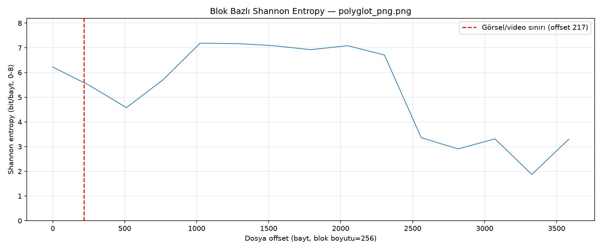
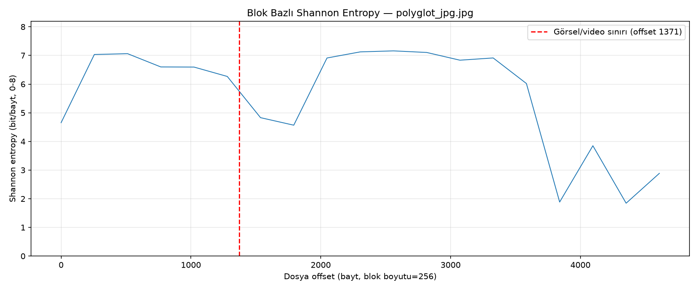

# Polyglot / Steganaliz Servisi — 1. Hafta Raporu (Gün 1-5)

**Dönem:** 18-22 Ağustos 2026
**Kapsam:** Dosya Format Mimarisi, Polyglot Oluşturma ve Header/EOF Analizi

---

## 1. Yönetici Özeti

1. Hafta kapsamında, X (Twitter) gibi platformlarda paylaşılan görsel
dosyaların arkasına gizlenmiş video/veri (**polyglot dosya**) tehdidini
tespit edebilen bir steganaliz sisteminin temel analiz katmanı sıfırdan
inşa edildi. Hafta sonunda elde edilen somut çıktı: **bir görselin arkasına
sentetik olarak MP4 video gömen bir üretici script, bu gömülü videoyu
%100 doğrulukla (false-positive üretmeden) tespit eden bir trailer
tarayıcısı, ve tespiti görselleştiren bir entropy analiz aracı** —
üçü de komut satırından (CLI) bağımsız çalışabilir durumda.

Beş günün tamamı planlandığı gibi tamamlandı, tüm kabul kriterleri hem
geliştirme sırasında hem de bu raporun hazırlanması için yapılan bağımsız
bir doğrulama turunda (Gün 1-5 script'lerinin yeniden çalıştırılmasıyla)
teyit edildi. Herhangi bir eksik veya açık madde kalmadı.

## 2. Hafta 1 Hedefi

Proje planına göre bu haftanın çıktısı şu şekilde tanımlanmıştır:

> "Gönderilen dosyadaki gizli video başlıklarını tespit eden çalışan Python
> analiz modülü (`scripts/detect_trailer.py` + `scripts/entropy.py`),
> CLI'dan çalıştırılabilir durumda."

Bu hedef, PNG/JPEG/MP4 dosya formatlarının iç yapısının binary düzeyde
öğrenilmesinden başlayıp, sentetik test verisi üretimi ve nihayetinde
tespit/görselleştirme araçlarının yazılmasıyla adım adım inşa edildi.

## 3. Kullanılan Teknolojiler

| Katman | Araç/Kütüphane |
|---|---|
| Dil / Ortam | Python 3.11.16, `.venv` sanal ortam |
| Görüntü/Video İşleme | OpenCV (`cv2`) 5.0.0, Pillow 12.3.0, NumPy 2.4.6 |
| Grafik | matplotlib 3.11.1 |
| Multimedya CLI | ffmpeg / ffprobe 9.0.1 |
| Hex İnceleme | hexyl 0.17.0, xxd |
| Backend (hazırlık) | FastAPI 0.141.1, uvicorn 0.52.3, python-multipart 0.0.32 |

---

## 4. Gün 1 — Ortam Kurulumu ve Oryantasyon

**Hedef:** Projenin geri kalanında kullanılacak geliştirme ortamının
eksiksiz ve çalışır halde kurulması.

Homebrew üzerinden `ffmpeg`, `hexyl` ve `python@3.11` kuruldu (sistemde
önceden yalnızca Python 3.9.6 vardı). Proje kökünde izole bir `.venv`
sanal ortamı oluşturulup `opencv-python`, `Pillow`, `fastapi`, `uvicorn`,
`numpy`, `matplotlib`, `python-multipart` paketleri kuruldu ve
`backend/requirements.txt` içine sabitlendi (pinned versions). Proje
klasör iskeleti (`backend/`, `frontend/`, `scripts/`, `samples/`, `docs/`)
oluşturuldu.

**Doğrulama:** `import cv2, PIL, fastapi, numpy, matplotlib` hatasız
çalışıyor; `ffmpeg -version` / `ffprobe -version` sürüm 9.0.1 döndürüyor;
`hexyl`/`xxd` ile örnek dosyalar hex formatında görüntülenebiliyor.

## 5. Gün 2 — Görsel ve Video Formatlarının Binary Düzeyde İncelenmesi

**Hedef:** PNG, JPEG ve MP4 formatlarının iç yapısını (chunk/marker/atom)
somut hex dökümleriyle anlamak ve belgelemek.

`samples/sample.png`, `samples/sample.jpg`, `samples/sample.mp4` dosyaları
`hexyl`/`xxd` ile incelenerek her formatın başlangıç imzası (magic bytes)
ve bitiş işareti tespit edildi, gerçek offset değerleriyle birlikte
`docs/format-notlari.md` dosyasına işlendi:

| Format | Başlangıç İmzası | Bitiş İşareti |
|---|---|---|
| PNG | `89 50 4E 47 0D 0A 1A 0A` | `IEND` chunk'ı (sabit CRC `AE 42 60 82`) |
| JPEG | `FF D8` (SOI) | `FF D9` (EOI) |
| MP4 | byte 4-7 = `ftyp` | sabit bitiş imzası yok, box uzunluklarıyla belirlenir |

`samples/sample.png` (217 bayt) için `IEND` chunk'ının offset `0xCD`'de
başladığı, `samples/sample.jpg` (1371 bayt) için `EOI`'nin offset
`0x559`'da bulunduğu ve `samples/sample.mp4` için `ftyp`/`free`/`mdat`/
`moov` atom sırasının (bu örnekte `moov`'ün `mdat`'ten **sonra** geldiği)
tam offset'leriyle not edildi. Bu bulgu, Gün 4'teki trailer tarayıcısının
neden yalnızca `ftyp` değil, `ftyp`/`moov`/`mdat` imzalarının hepsini
araması gerektiğini doğrudan gerekçelendirdi.

## 6. Gün 3 — Sentetik Polyglot (Resim+Video) Üretici Script

**Hedef:** Meşru bir görselin arkasına bir MP4 videosu ekleyerek, normal
görüntüleyicilerde sorunsuz açılan ama arkasında tam bir video barındıran
sentetik polyglot dosyalar üretmek.

`scripts/make_polyglot.py` yazıldı. Yaklaşımın mantığı basit ama kritik bir
gözleme dayanıyor: PNG/JPEG parser'ları format bitiş imzasına (`IEND`/`EOI`)
ulaştıklarında okumayı **durdurur**; spesifikasyon bu noktadan sonra bayt
bulunamayacağını garanti etmez. Bu sayede `image_bytes + video_bytes`
şeklinde ham bir concatenation, hem görüntüleyicide sorunsuz açılan hem de
arkasında geçerli bir MP4 saklayan bir dosya üretmeye yetiyor. Script,
görsel formatını (`detect_image_format`) ve MP4 imzasını (`validate_mp4`)
doğruladıktan sonra birleştirmeyi yapıyor.

**Test sonuçları:**

| Kombinasyon | Görsel | Video | Çıktı | Gizli video offset'i |
|---|---|---|---|---|
| PNG + MP4 | 217 bayt | 3471 bayt | 3688 bayt | 217 (`0xD9`) |
| JPEG + MP4 | 1371 bayt | 3471 bayt | 4842 bayt | 1371 (`0x55B`) |

Her iki durumda `çıktı boyutu = görsel + video` eşitliği tam sağlandı.
`file` komutu her iki polyglot dosyayı da orijinal görsel formatıyla
tanıdı, PIL ile açma/piksel okuma testleri sorunsuz geçti.

## 7. Gün 4 — EOF Ötesi Bayt Tarama ve Video Header Tespiti

**Hedef:** Görselin gerçek bitiş imzasından sonra kalan trailer baytlarını
tarayıp içinde bilinen bir video/konteyner imzası olup olmadığını tespit
eden `scripts/detect_trailer.py` script'ini yazmak.

Trailer'ı doğru bulabilmek için önce görselin **gerçek** bitiş noktasının
bilinmesi gerekiyor — ham `data.find(b"\xff\xd9")` gibi bir arama
yanıltıcı olabilir (JPEG'de gömülü EXIF thumbnail'ının kendi EOI'si veya
entropy-coded veri içindeki `FF` bayt-stuffing'i yüzünden). Bu yüzden
script, PNG için chunk zincirini (`length+type+data+CRC`) baştan takip
eden `find_png_end()`, JPEG için marker'ları gerçek bir parser gibi izleyip
`SOS` sonrası entropy verisini ve restart marker'larını atlayan
`find_jpeg_end()` fonksiyonlarını içeriyor. Bulunan trailer içinde
`ftyp`/`moov`/`mdat` (MP4), `RIFF` (AVI) ve EBML (WebM/MKV) imzaları
aranıyor; yanlış pozitifi önlemek için minimum trailer boyutu eşiği
(16 bayt) ve "bilinen imza zorunluluğu" kuralı uygulanıyor.

**Test sonuçları** (bu rapor için yeniden çalıştırılarak doğrulandı):

| Dosya | Beklenen offset | Script sonucu | Polyglot mu? |
|---|---|---|---|
| `polyglot_png.png` | 217 | 217, imza `mp4/ftyp` | EVET |
| `polyglot_jpg.jpg` | 1371 | 1371, imza `mp4/ftyp` | EVET |
| `sample.png` (temiz) | — | trailer 0 bayt | hayır |
| `sample.jpg` (temiz) | — | trailer 0 bayt | hayır |
| `sample.jpg` + 5 bayt `0x00` padding | — | trailer 5 bayt, imza yok | hayır (false-positive yok) |

Tespit edilen offset'ler, Gün 3'te `make_polyglot.py`'nin bildirdiği
offset'lerle **birebir örtüşüyor** — üretim ve tespit tarafının tutarlı
çalıştığını doğruluyor. `--json` bayrağıyla makine-okunabilir çıktı da
doğrulandı (`polyglot_status`, `analysis_summary` gibi alan adları, Gün
14'te tasarlanacak API şemasıyla uyumlu olacak şekilde seçildi).

## 8. Gün 5 — Shannon Entropy Analizi ve Görselleştirme

**Hedef:** Dosya içindeki veri yoğunluğu farklarını Shannon entropy
hesabıyla ortaya çıkarmak ve polyglot dosyalarda görsel/video geçişini
grafik üzerinde görünür kılmak.

`scripts/entropy.py` yazıldı: dosya sabit boyutlu bloklara (varsayılan
256 bayt) bölünüp her blok için `H = -Σ p(x)·log2(p(x))` formülüyle
bayt başına 0-8 bit aralığında entropy hesaplanıyor. Script, Gün 4'teki
`detect_trailer.analyze()` fonksiyonunu içe aktararak (kod tekrarını
önleyerek) görsel/video sınır offset'ini otomatik buluyor ve matplotlib
grafiğinde kırmızı kesikli çizgi olarak işaretliyor.

**Bulgular:**

| Dosya | Sınır offset | Gözlem |
|---|---|---|
| `polyglot_png.png` | 217 | Sınırda belirgin entropy sıçraması — video bölgesi ~7 bit/bayt, görece düz |
| `polyglot_jpg.jpg` | 1371 | Fark daha az belirgin (JPEG zaten yüksek entropili); sınır civarında hafif düşüş/toparlanma var |
| `sample.png` / `sample.jpg` (temiz) | tespit edilemedi | Sınır çizgisi çizilmiyor (beklenen davranış) |

Plan'da öngörülen risk doğrulandı: **sıkıştırılmış görsellerde (JPEG)
görsel/video ayrımı, sıkıştırmasız PNG'ye göre belirgin şekilde daha
zordur** — çünkü JPEG'in kendisi DCT tabanlı sıkıştırma sonucu zaten
yüksek entropili veri üretiyor. Bu bulgu, entropy analizinin tek başına
değil, Gün 4'teki imza/trailer tespitiyle **birlikte** bir sinyal olarak
kullanılması gerektiğini gösteriyor.

---

## 9. Hafta 1 Doğrulama Özeti

Bu raporun hazırlanması sırasında Gün 1-5'in tüm kabul kriterleri, ilgili
script'ler yeniden çalıştırılarak bağımsız olarak teyit edildi:

| Gün | Doğrulama Yöntemi | Sonuç |
|---|---|---|
| 1 | Paket import testi, `ffmpeg`/`ffprobe`/`hexyl` versiyon kontrolü | Geçti |
| 2 | `format-notlari.md` içerik ve offset kontrolü | Geçti |
| 3 | `file` komutu + boyut matematiği doğrulaması | Geçti |
| 4 | 5 farklı senaryo (2 polyglot, 2 temiz, 1 padding) + `--json` çıktısı | Geçti, false-positive yok |
| 5 | Grafik üretimi + sınır tespiti tutarlılığı | Geçti |

Eksik veya açık kalan herhangi bir madde tespit edilmedi.

## 10. Karşılaşılan Zorluklar ve Öğrenilen Dersler

- **JPEG'de gerçek EOI'nin bulunması:** Ham bayt araması (`FF D9`'u ilk
  bulduğu yerde durmak) gömülü EXIF thumbnail'leri veya bayt-stuffing
  nedeniyle yanlış offset verebilirdi; çözüm, JPEG marker yapısını gerçek
  bir parser gibi baştan sona takip etmekti (Gün 4).
- **MP4 atom sırasının sabit olmaması:** `moov` box'ı encoder'a göre
  `mdat`'ten önce veya sonra gelebiliyor; bu yüzden trailer taramasında tek
  bir imzaya değil, birden fazla bilinen konteyner imzasına güvenilmesi
  gerekti (Gün 2 bulgusu, Gün 4'e yansıtıldı).
- **Aynı köke sahip dosya adlarının çakışması:** `entropy.py`'nin ilk
  sürümünde `sample.png` ve `sample.jpg` için varsayılan çıktı dosya adı
  çakışıyordu (`entropy-sample.png`); dosya adı üretimi tam dosya adından
  türetilerek (`entropy-sample_png.png` / `entropy-sample_jpg.png`)
  düzeltildi.
- **JPEG'de entropy tabanlı ayrımın sınırlılığı:** JPEG'in kendi
  sıkıştırması nedeniyle PNG'ye kıyasla video geçişi daha zor ayırt
  ediliyor — bu, ileriki haftalarda (Gün 6, boyut sapma analizi) neden
  birden fazla bağımsız sinyalin (trailer imzası + entropy + boyut sapması)
  birlikte kullanılacağının gerekçesini oluşturuyor.

## 11. Hafta 1 Çıktısı

Plan'da tanımlanan hedefe ulaşıldı: gönderilen bir PNG/JPEG dosyasındaki
gizli video başlığını tespit eden, CLI'dan bağımsız çalıştırılabilir iki
modül (`scripts/detect_trailer.py`, `scripts/entropy.py`) hazır ve test
edilmiş durumda. Bu modüller, kendilerinden önceki günün çıktısını
(Gün 3 → Gün 4 → Gün 5 zinciri) yeniden kullanacak şekilde tasarlandı;
kod tekrarı yok.

## 12. Sonraki Adımlar (2. Hafta Önizlemesi)

**2. Hafta**, "Görüntü İşleme, Steganaliz ve Gizli Medya Ayıklama (Extraction)"
başlığı altında şu adımları içeriyor: teorik/gerçek dosya boyutu sapma
analizi (Gün 6), LSB/DCT tamamlayıcı gürültü analizleri (Gün 7), gömülü
videonun ayrı bir `.mp4` dosyası olarak çıkarılması — extraction (Gün 8),
çıkarılan videonun meta veri analizi (Gün 9) ve tüm pipeline'ın farklı
senaryolarda başarım testi (Gün 10). Hafta 2 sonunda, `scripts/extract.py`
ve destekleyici modüllerin tek bir `scripts/analyze.py` pipeline'ında
birleştirilmesi hedefleniyor.

## 13. Ekler — Üretilen Dosyalar

- `docs/format-notlari.md` — Gün 2 format imza/offset tablosu
- `docs/gun3-polyglot-uretici-raporu.md/pdf`
- `docs/gun4-trailer-tespit-raporu.md/pdf`
- `docs/gun5-entropy-analizi-raporu.md/pdf`
- `docs/entropy-polyglot_png_png.png`, `docs/entropy-polyglot_jpg_jpg.png`,
  `docs/entropy-sample_png.png`, `docs/entropy-sample_jpg.png`
- `scripts/make_polyglot.py`, `scripts/detect_trailer.py`, `scripts/entropy.py`
- `samples/polyglot_png.png`, `samples/polyglot_jpg.jpg` (sentetik test verisi, git'e dahil değil)
