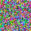
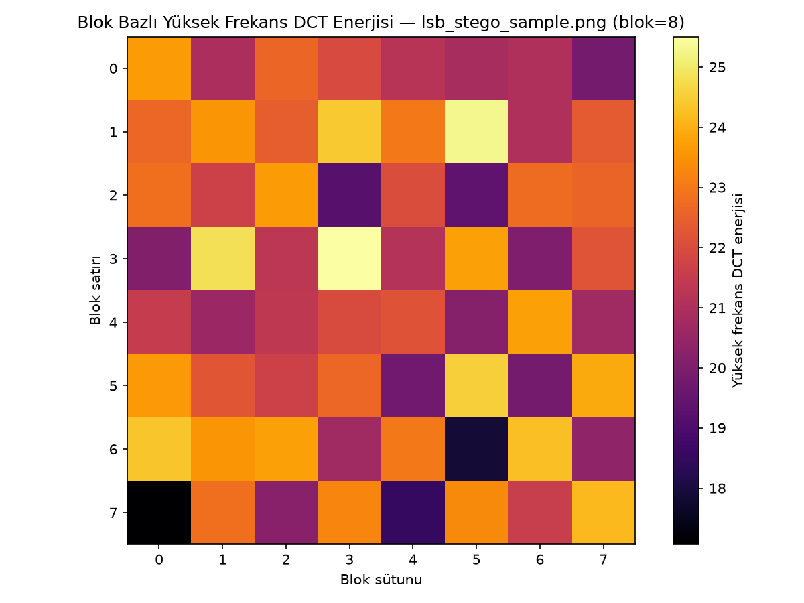
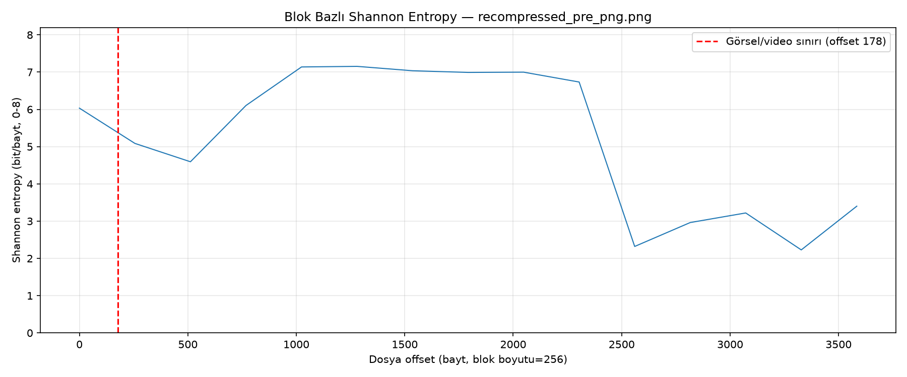
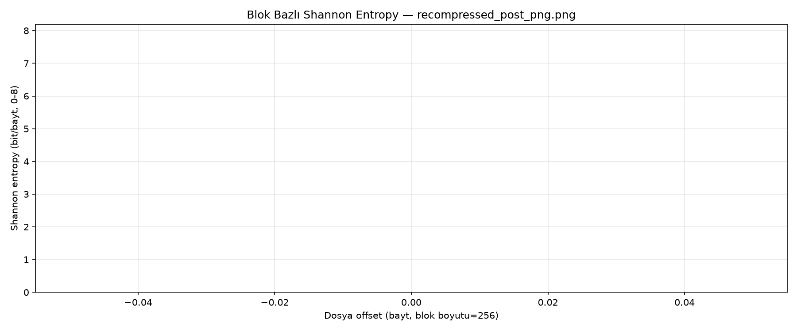

# Polyglot / Steganaliz Servisi — 2. Hafta Raporu (Gün 6-10)

**Dönem:** 24-28 Ağustos 2026
**Kapsam:** Görüntü İşleme, Steganaliz ve Gizli Medya Ayıklama (Extraction)

---

## 1. Yönetici Özeti

2. Hafta kapsamında, 1. Hafta'da inşa edilen temel tespit katmanı
(trailer tarama + entropy) iki tamamlayıcı sinyalle (dosya boyutu sapma
analizi, LSB/DCT gürültü analizi) güçlendirildi ve sistem, tespit
etmekle kalmayıp gizli videoyu **fiilen ayıklayıp** (`extract.py`)
meta verisini (`video_metadata.py`) çıkaracak hale getirildi. Hafta
sonunda üç bağımsız modül (`detect_trailer` + `entropy` + `size_analysis`)
tek bir pipeline'da (`scripts/analyze.py`) birleştirildi ve 4 farklı
senaryo/10 dosyalık bir test matrisinde ana tespit sinyali **%0
false-positive, %0 false-negative** ile doğrulandı.

Beş günün (Gün 6-10) tamamı planlandığı gibi tamamlandı. Bu raporun
hazırlanması için Gün 6-9'un tüm script'leri yeniden çalıştırılarak
bağımsız bir doğrulama turundan geçirildi (bkz. Bölüm 10); Gün 10'un
10 dosyalık test matrisi zaten `docs/test-sonuclari.md` içinde ayrıntılı
olarak doğrulanmış durumda. Herhangi bir eksik veya açık madde kalmadı.

## 2. Hafta 2 Hedefi

Proje planına göre bu haftanın çıktısı şu şekilde tanımlanmıştır:

> "Resim arkasındaki gizli videoyu ayıran ve bağımsız `.mp4` dosyası
> olarak kaydeden Steganaliz Motoru (`scripts/extract.py` + destekleyici
> modüller), tek bir `scripts/analyze.py` pipeline'ında birleştirilmiş."

Bu hedef, 1. Hafta'nın tek-sinyalli (trailer) tespit katmanına iki
tamamlayıcı istatistiksel sinyal eklenmesi (Gün 6, 7), ardından tespit
edilen videonun gerçekten bağımsız bir dosyaya dönüştürülmesi (Gün 8),
bu dosyanın adli olarak anlamlı meta verisinin çıkarılması (Gün 9) ve
son olarak tüm sinyallerin çok senaryolu bir test matrisinde birlikte
ölçülmesiyle (Gün 10) adım adım inşa edildi.

## 3. Kullanılan Teknolojiler

| Katman | Araç/Kütüphane |
|---|---|
| Dil / Ortam | Python 3.11, `.venv` sanal ortam (1. Hafta'dan devam) |
| Frekans/İstatistik Analizi | OpenCV `cv2.dct`, NumPy (Gün 7) |
| Video Meta Verisi | ffprobe (birincil), OpenCV `cv2.VideoCapture` (yedek) (Gün 9) |
| Görselleştirme | matplotlib — LSB bit-plane, DCT ısı haritası, entropy grafiği |
| Test Otomasyonu | `scripts/make_test_scenarios.py` (senaryo üretimi, Gün 10) |

---

## 4. Gün 6 — Teorik vs Gerçek Dosya Boyutu Sapma Analizi

**Hedef:** Görsel çözünürlüğü ve renk derinliğinden beklenen teorik dosya
boyutunu hesaplayıp gerçek boyutla karşılaştırmak; piksel verisiyle
açıklanamayacak sapmaları "şüpheli" işaretlemek.

`scripts/size_analysis.py` yazıldı. PNG için ham (sıkıştırmasız) boyut
`IHDR`'dan okunan genişlik/yükseklik/bit derinliği/renk tipinden (+ her
satır başına 1 filtre baytı) hesaplanıp tipik **%20** sıkıştırma oranıyla
teorik boyuta ölçekleniyor; JPEG için ham boyut `SOF0/SOF2`'den
hesaplanıp **%10** oranla ölçekleniyor (JPEG marker taraması, Gün 4'teki
`NO_LENGTH_MARKERS` kümesi yeniden kullanılarak yapıldı — kod tekrarı
yok). Sapma `%20`'yi aşınca (yalnızca pozitif yönde — sıkıştırmanın
küçültmesi normal) dosya `suspicious=true` işaretleniyor.

| Dosya | Format | Teorik boyut | Gerçek boyut | Sapma | Şüpheli mi? |
|---|---|---|---|---|---|
| `sample.png` (temiz) | PNG | 2470 B | 217 B | %-91.2 | hayır |
| `polyglot_png.png` | PNG | 2470 B | 3688 B | **%49.3** | **EVET** |
| `sample.jpg` (temiz) | JPEG | 1229 B | 1371 B | %11.6 | hayır |
| `polyglot_jpg.jpg` | JPEG | 1229 B | 4842 B | **%294.0** | **EVET** |

Her iki temiz dosyada sapma eşiğin altında, her iki polyglot dosyada
belirgin biçimde üstünde kaldı. **Sınırlama:** Sıkıştırma oranı
varsayımları (%20/%10) sentetik test görselleri için kalibre edildi;
gerçek fotoğraflarda içerik-bağımlı sıkıştırma oranı hassasiyeti
düşürebilir — bu yöntem tek başına değil, trailer/entropy sinyalleriyle
birlikte kullanılmalı (bu risk Gün 10'da fiilen doğrulandı, bkz. Bölüm 8).

## 5. Gün 7 — LSB ve DCT Frekans Alanı Gürültü Analizi

**Hedef:** OpenCV ile LSB steganografi izlerini ve DCT tabanlı frekans
anomalilerini incelemek; bu iki aracın projenin ana tehdit modeli
(trailer-append) yerine **tamamlayıcı** bir sinyal olduğunu göstermek.

Projenin ana tehdit modeli trailer-append polyglot olduğundan, mevcut
`polyglot_png.png`'de piksel LSB'i hiç değişmiyor — bu yüzden gerçek bir
LSB-steganografi demo örneği (`lsb_stego_sample.png`, sabit tohum
`seed=42` ile üretildi) ayrıca oluşturuldu ve üç dosya karşılaştırıldı:

| Dosya | LSB=1 oranı | DCT ort. yüksek frek. enerji | Yorum |
|---|---|---|---|
| `sample.png` (temiz) | %0.0 | 0.0 | Yüksek frekans yok |
| `lsb_stego_sample.png` (LSB-demo) | **%49.7** | **22.0** | Tekdüze gürültü — LSB-steganografi ile tutarlı |
| `polyglot_png.png` (trailer-append) | %0.0 | 0.0 | `sample.png` ile **ayırt edilemez** (beklenen) |

`polyglot_png.png`'nin LSB/DCT'de temiz dosyadan ayırt edilememesi bir
hata değil, tam tersine trailer-append yönteminin piksel verisini hiç
değiştirmediğinin kanıtı. **Sonuç:** LSB/DCT analizleri, ana tespit
mekanizmasının (trailer + entropy + boyut sapması) yerine değil, ona
tamamlayıcı bir sinyal olarak konumlandırılmalı.

## 6. Gün 8 — Extraction (Unpolyglot) Fonksiyonu

**Hedef:** Tespit edilen gizli videoyu görselden ayırıp bağımsız,
oynatılabilir bir `.mp4` dosyasına dönüştürmek.

`scripts/extract.py`, Gün 4'teki `detect_trailer.analyze()`'ın
hesapladığı `image_end_offset`'i (format-farkında, PNG `IEND`/JPEG marker
zinciri üzerinden) ayırma noktası olarak yeniden kullanıyor — offset
hesaplama mantığı tek kaynaktan (`detect_trailer.py`) besleniyor, tekrar
yazılmıyor. Polyglot olmayan bir dosyada hiçbir çıktı üretmeden anlamlı
bir `ValueError` ile reddediyor.

| Dosya | Ayırma offset'i | Görsel + Video = Toplam | `ffprobe` |
|---|---|---|---|
| `polyglot_png.png` | 217 | 217+3471=3688 ✅ | h264/64x64/2sn ✅ |
| `polyglot_jpg.jpg` | 1371 | 1371+3471=4842 ✅ | h264/64x64/2sn ✅ |

Ayıklanan görsel kısımları orijinal kaynak dosyalarla `cmp` ile
**bayt-bayt aynı** çıktı — ayırma kayıpsız tersine çevrilebiliyor. Temiz
bir dosyada script dosya yazmadan exit code 1 ile reddediyor (negatif
test doğrulandı).

## 7. Gün 9 — Ayıklanan Video Meta Verisi Analizi

**Hedef:** Ayıklanan videonun kare sayısı, süresi, çözünürlüğü ve codec
bilgisini çıkarmak; `ffprobe` yoksa OpenCV'ye otomatik düşen bir yedek
mekanizma kurmak.

`scripts/video_metadata.py`, birincil kaynak olarak `ffprobe -print_format
json` çıktısını parse ediyor; `ffprobe` bulunamazsa veya dosyayı
okuyamazsa `cv2.VideoCapture` ile aynı alanları bağımsız okuyup yedek
olarak kullanıyor. İki yöntem de her zaman çalıştırılıp birbirine karşı
çapraz doğrulanıyor (`used_opencv_fallback` alanıyla hangi kaynağın
birincil olduğu raporlanıyor).

| Dosya | Kare sayısı | Süre | Çözünürlük | FPS | Codec | ffprobe = OpenCV? |
|---|---|---|---|---|---|---|
| `polyglot_png_extracted.mp4` | 20 | 2.0 sn | 64x64 | 10.0 | h264 | ✅ birebir aynı |
| `polyglot_jpg_extracted.mp4` | 20 | 2.0 sn | 64x64 | 10.0 | h264 | ✅ birebir aynı |

Var olmayan bir dosyada anlamlı `FileNotFoundError` ile hata veriyor
(negatif test doğrulandı).

## 8. Gün 10 — Farklı Senaryolarda Tespit Başarımının Ölçülmesi

**Hedef:** Görsel sıkıştırma ve farklı format kombinasyonlarında sistemin
tespit başarımını en az 4 senaryo/10 dosya üzerinde ölçmek.

`detect_trailer` + `entropy` + `size_analysis`'i tek çağrıda birleştiren
`scripts/analyze.py` yazıldı; hiçbir sinyal tek başına "kesin karar"
olarak kullanılmıyor, üçü de yan yana raporlanıyor
(`threat_score`'a dönüştürme bilinçli olarak Gün 14'e bırakıldı).
`scripts/make_test_scenarios.py` ile 4 kategori (1-2: PNG/JPEG polyglot,
3a: embed-sonrası yeniden sıkıştırma, 3b: embed-öncesi yeniden
sıkıştırma, 4: temiz dosyalar + LSB-stego + gradient) için 10 dosyalık
bir test matrisi üretildi.

| Sinyal | Temiz dosyalarda FP | Polyglot dosyalarda FN |
|---|---|---|
| `trailer.polyglot_status` (ana karar) | **0/6 = %0** | **0/4 = %0** |
| `size.suspicious` (tek başına) | 1/6 = %16.7 (`lsb_stego_sample.png`) | 0/4 = %0 |

**Öne çıkan bulgular:**
1. Ana tespit sinyali (`detect_trailer`) 10/10 dosyada doğru (**%0 FP, %0 FN**); taşıyıcının embed öncesi farklı sıkıştırma seviyesiyle kaydedilmesi tespiti etkilemiyor.
2. **Embed sonrası yeniden sıkıştırma trailer'ı tamamen yok ediyor** (3688 → 178 bayt) — sistem bunu doğru şekilde "temiz" raporluyor; veri adli olarak da gerçekten kurtarılamaz hale geliyor.
3. `size_analysis` tek başına daha gürültülü: `lsb_stego_sample.png`'de trailer yok ama sapma %45.6 çıkıp yanlışlıkla "şüpheli" işaretleniyor — bu nedenle API katmanında (Gün 14) asla tek başına karar mercii olmamalı.
4. `entropy.entropy_delta`, `detect_trailer` bulduğunda görsel (~6.0-6.4 bit/bayt) ile video (~5.1-5.2 bit/bayt) bölgesi arasında tutarlı bir düşüş göstererek onu doğrulayan tamamlayıcı bir sinyal.

Tam sonuç tablosu ve JSON alan bazlı ayrıntılar `docs/test-sonuclari.md` içinde.

---

## 9. Hafta 2 Doğrulama Özeti

Bu raporun hazırlanması sırasında Gün 6-9'un script'leri yeniden
çalıştırılarak ilgili günlük rapordaki sonuçlarla birebir eşleştiği
bağımsız olarak teyit edildi; Gün 10'un 10 dosyalık test matrisi zaten
`docs/test-sonuclari.md`'de ayrıntılı doğrulanmış durumda.

| Gün | Doğrulama Yöntemi | Sonuç |
|---|---|---|
| 6 | `size_analysis.py --json`, 4 dosya (2 temiz, 2 polyglot) | Geçti, sapma yüzdeleri raporla birebir aynı |
| 7 | `lsb_analysis.py` + `dct_analysis.py --json`, 3 dosya | Geçti, LSB oranı/DCT enerjisi raporla birebir aynı |
| 8 | `extract.py --json`, 2 polyglot dosya | Geçti, boyut eşitliği ve `ffprobe` doğrulaması tutarlı |
| 9 | `video_metadata.py --json`, 2 ayıklanmış video | Geçti, ffprobe = OpenCV sonuçları birebir örtüşüyor |
| 10 | `docs/test-sonuclari.md` (10 dosya, 4 senaryo) | Önceden doğrulanmış, bu raporda referans alındı |

Eksik veya açık kalan herhangi bir madde tespit edilmedi.

## 10. Karşılaşılan Zorluklar ve Öğrenilen Dersler

- **Embed-sonrası yeniden sıkıştırma trailer'ı tamamen siliyor** (Gün 10):
  Bir platformun sunucu tarafı görsel işleme pipeline'ı (PIL
  `Image.open().load()` + `save()`) trailer-append polyglot'ları
  kendiliğinden etkisiz hale getiriyor. Bu bir tespit hatası değil —
  sistem bu durumu doğru şekilde "temiz" raporluyor — ama adli veri
  kurtarma açısından bir sınırlama olarak kabul edilmeli.
- **`size_analysis` tek başına yanlış pozitif verebiliyor** (Gün 10):
  LSB-steganografi gibi trailer içermeyen başka türden gizli veri
  taşıyan dosyalarda (`lsb_stego_sample.png`) sapma eşiği yanlışlıkla
  aşılabiliyor (%45.6). Ders: bu sinyal API katmanında (Gün 14) asla tek
  başına karar mercii olarak kullanılmamalı, yalnızca `detect_trailer`
  sonucunu destekleyen ikincil bir gösterge olarak ağırlıklandırılmalı.
- **LSB/DCT analizleri trailer-append'i yakalayamıyor** (Gün 7): Bu
  beklenen bir sonuç (piksel verisi değişmiyor), ama başta kafa
  karıştırıcı görünebilir — bu yüzden Gün 7 raporunda ayrıca bir
  "tasarım notu" ile neden bu araçların tamamlayıcı sinyal olarak
  konumlandırıldığı gerekçelendirildi.
- **Kod tekrarından kaçınma disiplini sürdürüldü:** Gün 8 (`extract.py`)
  Gün 4'ün offset hesaplama mantığını, Gün 6 (`size_analysis.py`) Gün
  4'ün marker taraması yardımcılarını, Gün 10 (`analyze.py`) üç modülün
  tamamını yeniden kullandı — hiçbir analiz mantığı iki kez yazılmadı.

## 11. Hafta 2 Çıktısı

Plan'da tanımlanan hedefe ulaşıldı: gizli videoyu tespit eden (1. Hafta),
iki tamamlayıcı istatistiksel sinyalle destekleyen (Gün 6-7), fiilen
ayıklayıp (Gün 8) meta verisini çıkaran (Gün 9) ve tüm bunları tek bir
pipeline'da (`scripts/analyze.py`) birleştirip çok senaryolu bir test
matrisinde doğrulayan (Gün 10) uçtan uca bir **Steganaliz Motoru** hazır.
`threat_score` gibi nihai bir skorlama formülünün tasarımı, Gün 10'un
amacı (tespit *başarımını ölçmek*) ile çakışmaması için bilinçli olarak
Gün 14'e (API katmanı) bırakıldı.

## 12. Sonraki Adımlar (3. Hafta Önizlemesi)

**3. Hafta**, "Web API (FastAPI) ve Arka Plan Servis Mimarisi" başlığı
altında şu adımları içeriyor: FastAPI proje iskeleti ve Pydantic
modelleri (Gün 11), dosya yükleme endpoint'i (Gün 12), 1-2. haftada
yazılan pipeline'ın API'ye asenkron entegrasyonu (Gün 13) ve
`threat_score`'u da içeren nihai JSON yanıt şemasının tasarlanması
(Gün 14). Hafta 3 sonunda dışarıdan sorgulanabilir, tam fonksiyonel bir
Steganaliz REST API Servisi hedefleniyor.

## 13. Ekler — Üretilen Dosyalar

- `docs/gun6-boyut-sapma-analizi-raporu.md/pdf`
- `docs/gun7-lsb-dct-analizi-raporu.md/pdf`
- `docs/gun8-extraction-raporu.md/pdf`
- `docs/gun9-video-metadata-raporu.md/pdf`
- `docs/gun10-test-senaryolari-raporu.md/pdf`
- `docs/test-sonuclari.md` — Gün 10'un 10 dosyalık tam sonuç tablosu
- `docs/lsb-*.png`, `docs/dct-*.png` — Gün 7 LSB/DCT görselleri
- `docs/gun10-entropy-recompressed_*.png` — Gün 10 entropy grafikleri
- `scripts/size_analysis.py`, `scripts/lsb_analysis.py`,
  `scripts/dct_analysis.py`, `scripts/extract.py`,
  `scripts/video_metadata.py`, `scripts/analyze.py`,
  `scripts/make_test_scenarios.py`
- `samples/extracted/` — Gün 8'de ayıklanan `.mp4`/görsel dosyaları (git'e dahil değil)
- `samples/test_matrix/` — Gün 10'un senaryo dosyaları (git'e dahil değil)
